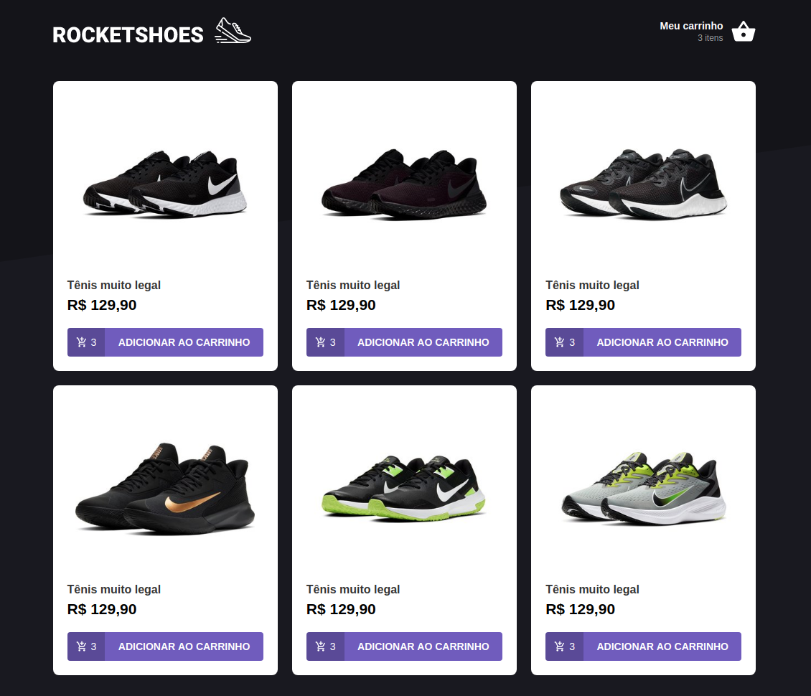
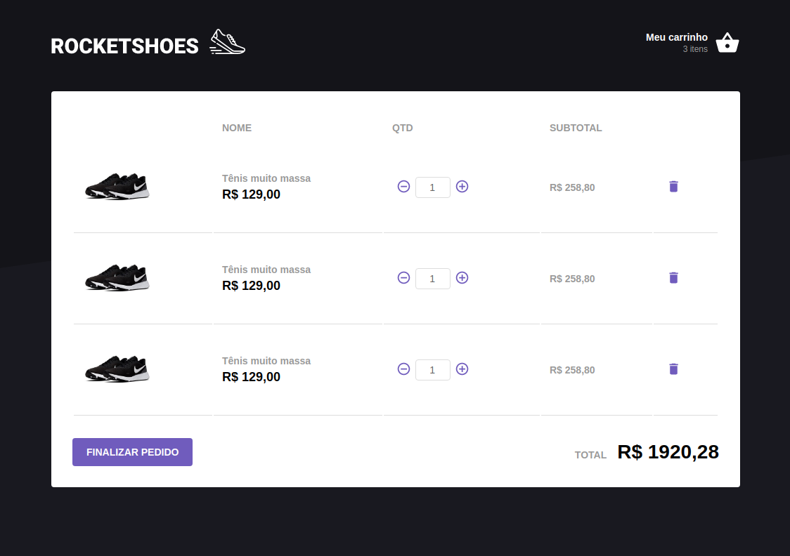

### Rocketshoes

An e-commerce example to study concepts of Redux and Flux architecture on React

#### How to run this project

1. Make sure you have `yarn` installed.
2. Make sure you have `json-server` installed.
3. Inside the `project folder` run the command `$ yarn` to download the dependencies.
4. Inside the `project folder` run the command `$ yarn json:server` to start the server.
5. Run the project using `$ yarn start`.

#### Project overview

